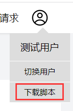
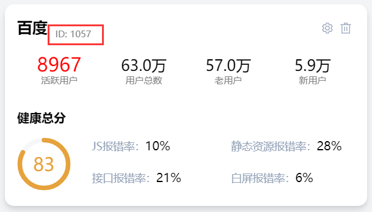

# 介绍
本项目为第四届字节跳动作业项目，实现了网站健康情况的监控，自动收集、上报、存储网站关键数据，主要包括以下4个方面

异常报错监控：脚本异常、资源异常、接口异常、白屏异常  
页面性能监控：如 DNS、FP、FCP、Dom Ready 等  
用户行为监控：PV/UV、页面停留时间等  
网络请求监控：请求路径、成功率、返回信息等  

详情请登录我们的[监控系统](http://47.100.57.184:9000/)查看

# 系统使用

## 注册网站
登录[监控系统](http://47.100.57.184:9000/)首页，创建网站实例，获取网站ID

## 下载 SDK
在用户菜单选项中下载[监控 SDK](https://gitee.com/du-hao-111/website-monitoring-script)


## 导入 SDK
在项目中导入监控脚本
```html
<script src="/monitoring.js"></script>
```

## 配置网站ID
调用 `setOption` 方法，传入一个配置对象：
* id: 网站ID 
* showDebug: 上报日志的同时是否在控制台打印(用于测试)

下面是默认选项
```html
<script>
  setOption({ id: 1018, showDebug: true })
</script>
```

网站ID 在下图位置


## 配置完成
只需完成以上配置，就可以在监控系统实时了解线上应用的健康情况
# 仓库结构
- main.ts：项目入口文件
- App.ts：入口组件，定义全局样式
- src/api：封装网络请求的发送
- src/assets：静态资源
- src/common：各组件通用的公共函数
- src/interface：定义通用的类型
- src/layout：页面整体布局
- src/mock：Mock虚拟服务器
- src/pages：各页面组件及功能
- src/router：定义项目路由
- src/store：定义状态仓库
- public：无需打包的静态资源
- dist：代码的打包目录

# 开发流程
## 克隆本仓库
```shell
git clone https://gitee.com/du-hao-111/monitoring-system
```

## 安装依赖
```shell
pnpm i
```

## 启动项目
```shell
pnpm run dev
```

## 项目打包
```shell
pnpm run dev build
```

# 开发须知
## 代码规范
本仓库配置了eslint 与 commitlint，提交代码需要符合规范，具体可以访问[这篇掘金](https://juejin.cn/post/7091276495972204580)查看

## 后端服务
本项目设置了后端[仓库](https://gitee.com/du-hao-111/monitoring-system-backend)，也可以选择开启Mock

```ts
// src/main.ts
import './mock/mockServe' // 启动Mock服务器
```
```ts
// src/api/ajax.ts
const ajax = axios.create({
  baseURL: '/mock', // 基础路径
  timeout: 6000, // 请求超时时间
})
```

## 生产环境
为了提高性能，本项目采取了一些生产环境下的优化，开发期间可以做出以下修改

```ts
// src/main.ts
import 'element-plus/dist/index.css' // 开发环境下解开
// window.addEventListener('load', () => {
//   reqCSS().then((res) => {
//     const link = document.createElement('style')
//     link.innerText = res.data
//     document.head.insertBefore(link, document.head.firstChild)
//   })
//   // 预加载地图数据
//   reqMap()
// })
```